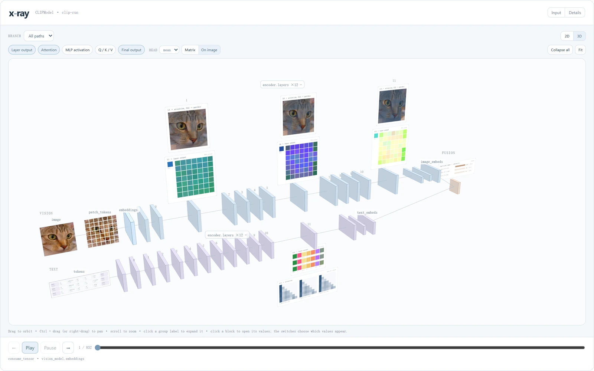
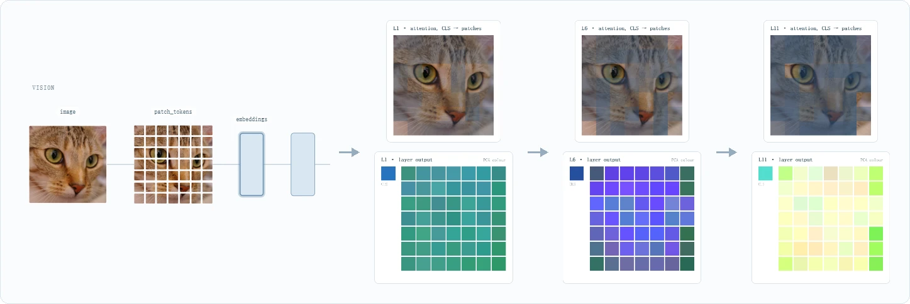
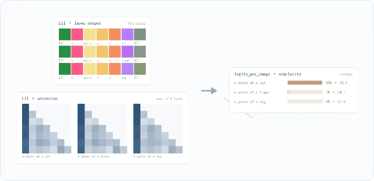
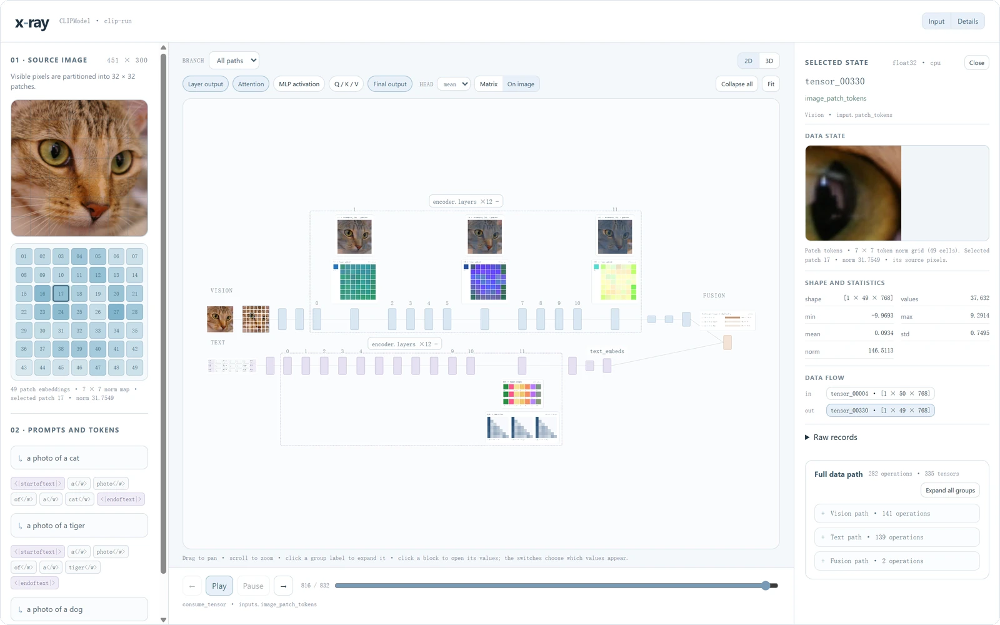
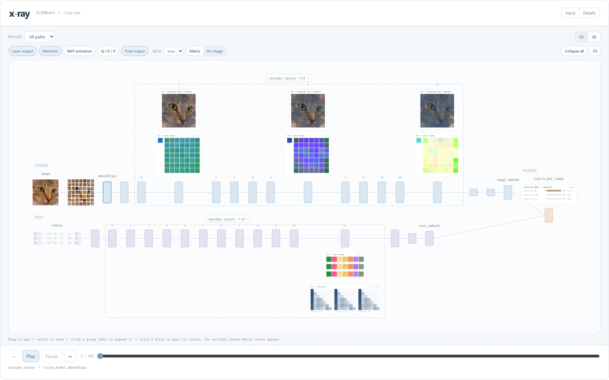
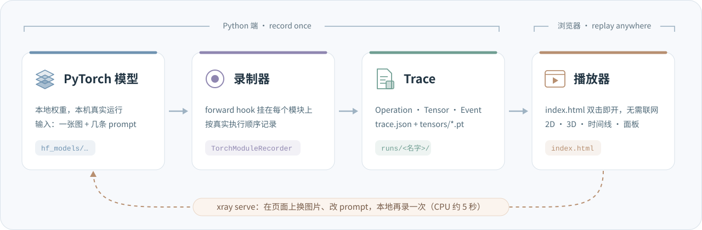

<p align="center">
  
</p>

<p align="center">
  <b>跑一次真实的 PyTorch 推理，把它变成一个能一层层打开、一步步回放的网页。</b><br>
  <sub>Record one real PyTorch inference, then replay it layer by layer in your browser, fully offline.</sub>
</p>

<p align="center">
  
  
  
  
  <a href="LICENSE"></a>
</p>

<p align="center">
  
</p>

结构图只告诉你网络**长什么样**。x-ray 告诉你：**这一张图、这几句话**送进去以后，每一层**到底算出了什么**。

它在本机跑一次真实推理，按执行顺序记下每一次模块调用、每一个 Tensor、每一个事件，再导出成网页。你可以展开任意一层，看它的输出和注意力；也可以拖动时间线，把整个前向过程一步一步重放。浏览器里不跑模型，页面上的每个数都来自那一次真实运行。

## ✨ 亮点

- **真实推理，不是示意图**：模块、Tensor、事件都来自那一次前向；时间线就是真实的执行顺序，不是拓扑排序。
- **每一层都能打开**：层输出按 PCA 着色，注意力可以画成矩阵，也可以直接叠在原图上，还有 MLP 激活和 Q / K / V。
- **每个值都能追到源头**：点任意一块、一个面板或一个 patch，右栏列出形状、统计量，以及它从哪个算子来、流向哪里。
- **2D、3D 随时切换**：平面图看结构，3D 看层叠；展开的层和打开的面板在两种视图间保持不变。
- **离线页面，拿走就能看**：导出的 `index.html` 已经嵌好全部 trace 和面板数据，连同 `assets/` 里的原图一起拷走，双击就能打开。
- **在页面上换输入**：`xray serve` 起一个本地服务，上传图片、改几条 prompt，CPU 上大约 5 秒就录好新的一次。

## 🔬 跟着一张猫的照片走一遍

下面的图都截自同一次运行：CLIP ViT-B/32 看一张猫的照片，同时读三条 prompt：*a photo of a cat*、*a photo of a tiger*、*a photo of a dog*。

**① 图片被切成 49 个 patch，一层层往上传。** 打开视觉编码器的任意一层：上面是 CLS 对各个 patch 的注意力，直接叠在原图上，越暗表示越少被关注；下面是这一层每个 token 的输出，投影到 PCA 前三个主成分后着色。各层共用同一组 PCA 基，所以颜色可以跨层比较。

<p align="center">
  
</p>

**② 文字那一路也能打开。** 每条 prompt 一行，每个 token 一格。文本编码器的注意力是因果的，所以画出来是一个下三角。最后图文向量做相似度，softmax 给出答案：**98% 是猫**，2% 像老虎，几乎不可能是狗。

<p align="center">
  
</p>

**③ 每个值都能追到源头。** 在左栏点第 17 个 patch（猫的眼睛），右栏马上给出它对应的原图像素、形状与统计量，以及它从哪个算子来、流向哪里。在右栏的 Full data path 里点某个算子的 `Focus operation`，模型图会自动把镜头移到那一块。

<p align="center">
  
</p>

**④ 把整张图铺满。** 左右两栏看过之后，可以用顶栏的 `Input`、`Details` 收起，模型图会铺满整个窗口并保持居中；图右上角的 `2D | 3D` 随时切换视角。

<p align="center">
  
</p>

## ⚙️ 它是怎么工作的

<p align="center">
  
</p>

- **录制**：给模型的每个模块挂上 forward hook，按真实执行顺序记下三样东西：Operation（哪个模块被调用、吃进什么、吐出什么）、Tensor（形状、统计量、预览和原始值）、Event（发生的先后）。
- **Trace**：一次运行的全部记录，就是 `trace.json` 加上 `tensors/*.pt`。播放器要画的中间值（PCA 颜色、注意力等）在导出时从原始 Tensor 算好，嵌进页面。
- **回放**：播放器是纯前端页面，只读数据、不跑模型。`xray serve` 打开旧运行时会按当前代码重新生成页面，以前录的运行也能用上新界面。

一句话：**record once, replay anywhere**。Python 负责执行和记录，浏览器只负责看。

## 🚀 三步上手

**1. 安装**

```bash
conda env create -f environment.yml
conda activate xraynns
python -m pip install -e ".[clip]"
```

装好后就有了 `xray` 命令。CPU 就够用，Apple Silicon 上可以用 MPS。

**2. 把 CLIP 权重下载到本地**（只要 PyTorch 权重，约 580 MB）

```bash
hf download openai/clip-vit-base-patch32 \
  --local-dir models/openai/clip-vit-base-patch32 \
  --exclude "*.h5" --exclude "*.msgpack"
```

权重放在 `models/` 下，这个目录不入库（见下面的"目录约定"）。x-ray 只读本地文件，运行时用 `--model` 传入模型目录，自己不会联网下载。

**3. 打开页面**

```bash
xray serve --model models/openai/clip-vit-base-patch32
```

浏览器访问 <http://127.0.0.1:8765/>。第一次还没有任何运行，页面会直接给出上传表单：选一张图、写几条 prompt、点 `Run CLIP`，几秒后页面就会打开这次运行。点 `encoder.layers ×12 +` 展开各层，再点某一层打开它的面板。以后想换输入，点顶栏的 `New run` 就行。

不想起服务的话，也可以在命令行录一次，生成的页面双击就能打开：

```bash
xray clip-run \
  --model models/openai/clip-vit-base-patch32 \
  --image cat.png \
  --text "a photo of a cat" --text "a photo of a dog" \
  --output runs/clip/cat
```

## 🗂️ 目录约定

| 目录 | 放什么 | 入库 |
| --- | --- | --- |
| `xray/` | 工具本体：录制器、Trace 格式、导出器与播放器、本地服务 | 是 |
| `models/` | 模型单独存放：下载的权重放 `models/<组织>/<名字>/`，自定义模型放 `models/<名字>/`（录制脚本、测试、说明、本地权重），见 [models/README.md](models/README.md) | 只有 README |
| `runs/` | 每次录制的数据：`runs/<模型>/<运行>/`，含 `trace.json`、中间 tensor 和页面 | 否 |

`models/` 和 `runs/` 都写进了 `.gitignore`：放进去的权重、自定义模型代码和录制数据不会被误提交。自定义模型的录制脚本只依赖 `xray`，`xray/` 里的代码不会反过来依赖它们。

## 📖 使用说明

<details>
<summary><b>页面速查</b></summary>

宽屏时页面分左、中、右三栏，窄屏时上下排列。宽屏时页面本身不滚动：中栏的模型图和时间线填满窗口，左右两栏内容多时各自滚动，也都可以收起，收起状态刷新后保留。

| 位置 | 内容 |
| --- | --- |
| 顶栏 | 运行下拉框、`New run`；右侧 `Input`、`Details` 收起或展开左栏、右栏 |
| 左栏 | 本次输入：原图、7×7 patch 格，以及 `Prompts and tokens`（每条 prompt 和它的 token）。点 patch 格可以查看这个 patch 的 embedding |
| 模型图 | 上方是 `Branch` 过滤和 `2D`、`3D` 切换，再往下是中间值开关和 `Collapse all`、`Fit`。开关只列出本次运行记录到的值。图中 vision 在上，text 在下，fusion 在右 |
| 时间线 | 在模型图正下方。`←`、`Play`、`Pause`、`→` 和滑条按记录的事件顺序回放，当前事件所在的层会高亮 |
| 右栏 · Selected state | 选中块、面板、算子或时间线事件后显示：名称、类型与所在阶段；`Data state` 预览；形状与统计量；`Data flow`（所属算子的输入输出、这个 tensor 的来源与去向）；原始记录 |
| 右栏 · Full data path | 列出记录到的全部算子，按分支分组。点 `Focus operation` 或某个输入输出，模型图会移到对应的块并选中它：折叠的组自动展开，块太小时放大到可读；直接点图中的块不会移动镜头 |

</details>

<details>
<summary><b>查看中间值</b></summary>

1. 点 `encoder.layers ×12 +`，展开 12 层。
2. 点其中一层，它的面板出现在上方（vision）或下方（text），再点一次收起。可以同时打开几层对比。
3. 图上方的开关决定面板显示哪些值：`Layer output`、`Attention`、`MLP activation`、`Q / K / V`、`Final output`，默认打开第一个和最后一个。
4. 看注意力时，`Head` 可选 `mean`（所有 head 的平均）或单个 head，显示方式可选 `Matrix` 或 `On image`。
5. 点面板，右栏显示对应的 tensor。`Fit` 显示全图，`Collapse all` 收起所有层。

| 面板 | 画法 |
| --- | --- |
| Layer output、Q/K/V | 每个 token 一个色块，颜色是 token 向量在 PCA 前三个主成分上的投影。同一分支里，层输出、Q、K、V 各有一组 PCA 基，由各层共用，所以同一种值的颜色可以跨层比较。vision 画成 CLS 加 7×7 网格，text 每条 prompt 一行 |
| Attention | 行是 query，列是 key，越亮注意力越大，弱值经过提亮。`On image` 把 CLS 对各 patch 的注意力叠在原图上，关注少的 patch 变暗 |
| MLP activation | 每个 token 经过激活函数后，大于 0 的神经元所占比例 |
| Final output | embedding 画成色带；fusion 显示每条 prompt 的 softmax 概率和 logit |

2D 视图里拖动空白处平移，滚轮缩放。3D 视图里左键拖动旋转，左右最多各转 90°；右键拖动，或按住 Ctrl / ⌘ / Shift 用左键拖动，可以平移；滚轮缩放。点击节点、展开或收起组都不会改变缩放。地址末尾加上 `#3d`，页面会直接进入 3D。

</details>

<details>
<summary><b>在页面上提交新输入</b></summary>

点顶栏的 `New run`，左栏顶部会展开表单。不选图片时沿用当前运行的图片。表单预填当前运行的 prompts，可以修改、删除，或点 `+ Prompt` 添加；最多 8 条，每条不超过 300 个字符，超过 CLIP 77 个 token 上限的部分会被截断。

点 `Run CLIP` 后，服务在本机运行一次 CLIP，完成后页面跳到新的运行。结果保存在 `runs/clip/live/<提交时间>/`，每次提交都新建目录，不覆盖旧结果。图片打不开、没有 prompt 或模型运行失败时，页面回到原来的运行，并在顶部显示原因。

服务只监听 127.0.0.1，其他网站借浏览器提交的表单会被拒绝。页面默认显示最近一次运行，可以用顶栏下拉框切换到 `runs/` 下的其他运行；在别处启动时用 `--runs` 指定运行目录，端口被占用时用 `--port` 更换。

</details>

<details>
<summary><b>命令行参数与输出</b></summary>

`xray clip-run` 的参数：

| 参数 | 说明 |
| --- | --- |
| `--model` | 本地 CLIP 目录，必填 |
| `--image` | 输入图片，必填 |
| `--text` | prompt 文本，至少一条；多条时重复这个参数 |
| `--output` | 输出目录，默认 `runs/clip/latest`，已存在时覆盖 |
| `--device` | `auto`、`cpu` 或 `mps`，默认 `auto`，有 MPS 时用 MPS |
| `--no-raw` | 不保存 `.pt` 中间 tensor，生成的页面没有中间值面板 |
| `--trace-id` | 写入 trace 的标识，默认 `clip-run` |

一次运行的输出（三条 prompt 为例）：

```text
runs/clip/cat/
├── index.html              页面，已内嵌 trace 和面板数据（约 5.8 MB）
├── trace.json              记录的 Operation、Tensor 和 Event
├── assets/input-image.png  输入图片
└── tensors/*.pt            中间 tensor，单个超过 4 MB 的不保存（合计约 45 MB）
```

离线查看只需要 `index.html` 和 `assets/`，这时页面没有运行下拉框和 `New run`。`xray serve` 打开一次运行时会读 `trace.json` 和 `tensors/`，按当前代码重新生成页面。

`xray serve` 另有 `--runs`（运行目录，默认当前目录下的 `runs/`）、`--port`（默认 8765）和 `--device`。`xray clip-info <模型目录>` 打印模型配置摘要，包括层数、head 数和隐藏维度。

</details>

## ❓ 常见问题

- **找不到 `xray` 命令**：环境没有激活，先运行 `conda activate xraynns`。
- **页面只有上传表单，看不到之前的运行**：服务只在 `--runs` 目录（默认是当前目录下的 `runs/`）往下四层以内找带 `trace.json` 的运行。回到项目根目录启动，或者用 `--runs` 指定。
- **端口被占用**：加 `--port 8766`。

## 🗺️ 现状

目前内置 CLIP ViT-B/32（图像、文本两个编码器加相似度）。录制器用的是通用的 PyTorch forward hook，Trace 格式也不绑定具体模型。想看看别的模型里发生了什么？欢迎开 issue 或者提 PR。

如果 x-ray 帮你看懂了某一层，欢迎点个 ⭐。

## 🙏 致谢

- 3D 视图用的是 [Three.js](https://threejs.org/)（MIT），打包文件和许可证在 `xray/exporters/vendor/`。
- 示例模型是 OpenAI 的 [CLIP ViT-B/32](https://huggingface.co/openai/clip-vit-base-patch32)。
- 截图里的猫是 scikit-image 自带的示例图片 `chelsea.png`，Stéfan van der Walt 摄，CC0。

## 📄 许可证

x-ray-nns 以 [MIT 许可证](LICENSE)发布，可以自由使用、修改和分发，保留版权与许可声明即可。
